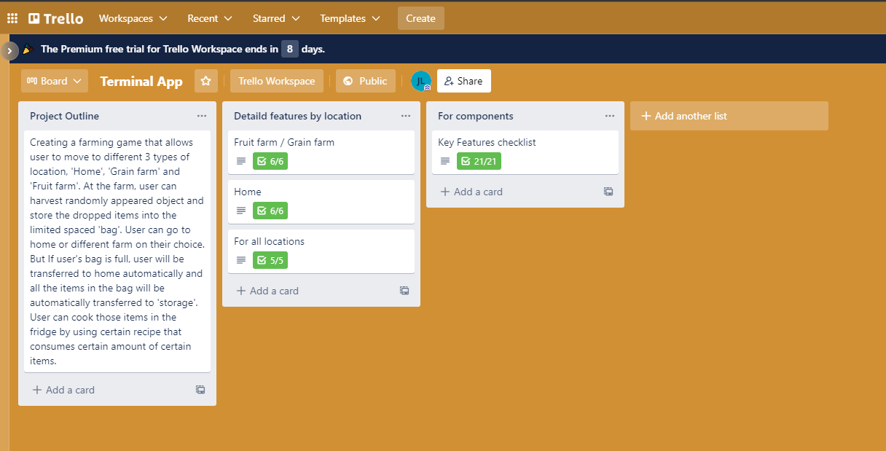
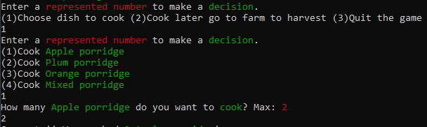
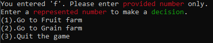
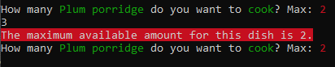
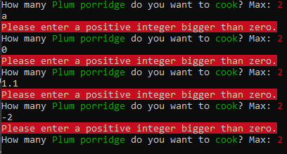

# Project Overview
## Please check my [Github repository](https://github.com/lmh4686/Terminal_App) to view the codes.
## Please check my [Trello](https://trello.com/b/CeoQTkAx/terminal-app) to check project planning.
### If Trello link doesn't work, please check these txt files below.
 - [Fruit farm / Grain farm](docs/tfarms.txt)
 - [Home](docs/thome.txt)
 - [For all locations](docs/tall.txt)
 - [Key Features checklist](docs/tcomponents.txt)  

## [PEP8](https://peps.python.org/pep-0008/) style has been applied for this project.
## This farming game is inspired from [Minecraft](http://minecraft.net/minecraft).
## Systme requirements:
  - ### [Ubuntu](https://ubuntu.com/) for Windows users or [Xcode](https://developer.apple.com/xcode/) and [Homebrew](https://brew.sh/) for Mac users.
  - ### [Python3](https://www.python.org/downloads/)
## Applied packages and module
 - [PrettyTable_3.4.1](https://pypi.org/project/prettytable/)
    - Used for printing a table form.
 - [Colorama_0.4.5](https://pypi.org/project/colorama/)
    - Used for giving a background color, font color, style to printed texts.
 - [AsciiMagic_1.6](https://pypi.org/project/ascii-magic/)
    - Used for converting images to ascii art. 
 - [Random](https://docs.python.org/3/library/random.html)
    - Used for picking random objects, random number within certain range.
***

# Installation guide 
## Systme requirements:
  - ### [Ubuntu](https://ubuntu.com/) for Windows users or [Xcode](https://developer.apple.com/xcode/) and [Homebrew](https://brew.sh/) for Mac users.
  - ### [Python3](https://www.python.org/downloads/)
## Applied packages, module:
*Note: All of below packages will be installed automatically after your authorization.*
 - [PrettyTable_3.4.1](https://pypi.org/project/prettytable/)
 - [Colorama_0.4.5](https://pypi.org/project/colorama/)
 - [AsciiMagic_1.6](https://pypi.org/project/ascii-magic/)
 - [Random](https://docs.python.org/3/library/random.html)
## Guidance for Windows users
### 1. Install [Windows Terminal](https://apps.microsoft.com/store/detail/windows-terminal/9N0DX20HK701?hl=en-au&gl=au)
### 2. Install [Ubuntu 22.04.1 LTS](https://apps.microsoft.com/store/detail/ubuntu-22041-lts/9PN20MSR04DW?hl=en-au&gl=au)
### 3. Enable the optional feature from PowerShell
```
Enable-WindowsOptionalFeature -Online -FeatureName Microsoft-Windows-Subsystem-Linux
```
 - This will restrart your computer.
This guidance is originally posted on [HERE](https://janelbrandon.medium.com/a-guide-for-using-wsl-for-development-d135670313a6).
<!-- ### 3. Install [Python 3.10](https://www.python.org/downloads/)
#### In your ubuntu, apply this code one by one to install Python: -->
### 4. Install [Python 3](https://www.python.org/downloads/) by applying commands below to ubuntu.
```
sudo apt update
sudo apt install software-properties-commonsoftware-properties-common
sudo add-apt-repository ppa:deadsnakes/ppa
sudo apt update
sudo apt install python3.10
```
 - This python installaion guide is originally from [here](https://phoenixnap.com/kb/how-to-install-python-3-ubuntu).
### 5. Clone the files from [this repository](https://github.com/lmh4686/Terminal_App) by applying code below.
```
git clone https://github.com/lmh4686/Terminal_App.git
```
### 6. After installation, direct to [src](src) folder.
```
cd Terminal_App/src
```
### 7. Apply this code to excecute the program.
```
./farming_game.sh
```
### 8. Authorise the program to activate Virtualenv and download packages.
  
 - Enter `Y` to authorize.
 - This will create a virtual environment and download required packages.
### 9. Enjoy the game.

***
## Guidance for Mac users
*Note: Step1 and 2 guidences are referenced from [here](https://edstem.org/au/courses/9040/lessons/24154/slides/170970).*
### 1. Go to your terminal and install xcode by running this command.
```
xcode-select --install
```
### 2. Click install and accept license agreement.
### 3. Install Homebrew.
*Note: Step3 ~ step5 guidences are referenced from [here](https://edstem.org/au/courses/9040/lessons/24154/slides/170971).*
```
/bin/bash -c "$(curl -fsSL https://raw.githubusercontent.com/Homebrew/install/master/install.sh)"
```
 -Press enter to contiue when prompted.
 ### 4. Install tldr by running following command.
 ```
 brew install tldr
 ```
 ### 5. Go to Guidance for Windows users and follow the steps from 4.
 #### **Note: When 'ubuntu' is mentioned, apply the same command to your terminal.**
***
# Program features
## Porgram overview
There're three different types of locations that user can explore. 2 are fruit farm and grain farm, the other is home. The main goal is harvesting resources from the farms and cooking at the home. 
### Key components 
#### 1. Harvest
 - User can harvest discovered items
 - Each farm offers different kinds of items to harvest
#### 2. Bag
 - Can contain harvested item from farms
 - 30 limited space
#### 3. Storage
 - No space limit but only accessible at home.
 - Automatically receives all items from 'bag' on arrval to home.
#### 4. Recipes
 - Contain 4 dishes's recipe Apple porridge, Orange porridge, Plum porridge and Mixed porridge.
 - Each dish contains differrent required amount of items to cook.
#### 5. Cook
 - Once storage has enough item to cook user can cook at home.
 - Consume items in the storage based on selected dish's recipe.
***

## Program detailed instruction
### Landing
  
### Read the options and enter one of the provided number to make a decision.  
 - Enter 1 to go to Fruit farm
 - Enter 2 to go to Grain farm
 - Enter 3 to terminate the program
### Fruit farm
  
### On arrival, a random harvestable object will appear that could be an 'Apple', 'Orange' and 'Plum'.   
### Users have options as follows :

### (1)Harvest :

 - Random amount(from 1 to 3) of harvested object will store to the 'bag'.
 - Shows available space of the 'bag' after harvest.
 - When bag gets full it will automatically take users to 'home':  
 - *Note: Further information about home is available in Home article.*  

### (2)Skip :

 - Skip the current object and show the next random object.

### (3)Check bag:

 - Show a table of item and amount for each.

### (4)Check recipes:

 - Show a table of recipes seperated by dish name and recipe for each.

### (5)Go to Grain farm:

 - Move to Grain farm
 - Further information is available in Grain farm article.

### (6)Go to home:

 - Move to Home
 - Further information is available in Home article.

### (7)Quit the game:

 - Immediately terminates the program.
***
### Grain farm:

### Shares same features with Fruit farm but different harvestable objects: 
 - Wheat
 - Corn
 - Oat
### Another difference is '(5) Go to Fruit farm' that takes user to 'Fruit farm'.
***
### Home:
### Home does not offer harvestable objects but users can cook. **On arrival, all items in the 'bag' will be transferred to 'storage' that has unlimited space.** 
### Then, program will check if there's enough grocery to cook by comparing items in the 'storage' with the 'recipes'.
### If there is not enough item to cook:
  
Show updated storage and let users to choose to go to farm.
### If storage has enough item to cook that meet any of specific dish's recipe, it shows a list of available amount of dish to cook.
  
*Note: Choice of (2) will prompt users to choose the farm and move to selected farm. Choice of (3) will terminate the program.*   
(1)Choose dish to cook:  
  
User can select one of the available dish to cook.  
If user choose 'Apple porridge':  
  
Asking user a number of dish to cook.  
If user enter '2':  
  
It will show a number of dish that user cooked and updated storage after cook.  
User can choose another dish to cook or go to farm.  
If there's no more available dish to cook:  
  
User will get asked to go to farm.
# Error handling for inputs
### When user not type the provided number and :
#### **when Input reamins as string.**
  
 - Raise and catch custom error 
 - returns users' input with error message and let users retry it.
#### **when Input converted to an integer and :**
 - user input integer but bigger than given option:  

   - Raise and catch custom error
   - Return allowed maximum amount 
 - user input is not integer or smaller than 1:  
  
   - Catch ValueError or raise and catch custom error
   - Print error message
### For KeyboardInterrupt
#### Case 1  
  
Catch KeyboardInterrupt and return error message with key number to quit the game.  
#### Case 2  
   
Same principle with Case 1 on different prompt.   
#### Case 3  
  
When there's no option to quit the game. Print error message.
# Testing
## Unit testing
Please check [test_module.py](src/test_module.py) for detail.
## Manual testing
### *Note: These tests only applied to the cases that unit test didn't cover from [test_module.py](src/test_module.py).*
### - For farms :
| Features | Case | Expected result | Test result | Pass the test
| ----------- | ----------- | ----------- | ----------- | ----------- |
| Harvest | Item dropped bigger amount than bag's available space | Add only the amount of left over space, take user to home, transfer items to storage | As expected for all cases | O
| Skip | Appeared object is apple | Skip the current object, shows another random object | Orange appeared | O
| Check bag | Harvested 2 orange and 3 oat | Show only what are in the bag, not show other items that values are 0 | Showing 2 orange 3 oat | O
| Check recipes | N/A | Show all 4 recipes | As expected | O
| Go to Grain farm | Currently at the Fruit farm | Move to Grain farm. Grain objects to appear. | As expected, Wheat appeared | O
| Go to Fruit farm | Currently at the Grain farm | Move to Fruit farm. Fruit objects to appear. | As expected, Plum appeared | O
| Go to home | Bag has 5 orange, 3 oat, 10 corn. Storage has 3 oat | Move to home, Transfer all items to the storage | Bag gets empty, Storage has 5 orange, 6 oat, 10 corn | O
| Quit the game | N/A | Program terminated after print message | As expected | O
***
### For home : 
| Features | Case | Expected result | Test result | Pass the test
| ----------- | ----------- | ----------- | ----------- | ----------- |
| N/A | **Case A :** User just arrived home and storage has been updated to have: 12 Plum, 8 Apple, 24 Orange, 10 Wheat, 16 Oat, 8 Corn | Printed message includes a list of available dish to cook that meets the recipe with 'Choose dish to cook' option. | Message includes 1 Apple porridge 2 Plum porridge, 2 Orange porridge, 2 Mixed porridge  with 'Choose dish to cook' option. | O
| Choose dish to cook | Under same storage condition with Case A | Show a list of available dish and let user to select one | Show (1)Apple porridge, (2)Plum porridge, (3)Orange porridge, (4)Mixed porridge | O
| Cook | Under same storage condition with A, user chose Mixed porridge to cook | Ask user to type a number of dish to cook with max number guidance | "How many Mixed porridge do you want to cook? Max: 2" | O
| N/A | Continued from above, user typed 2 | Print dish with amount that user cooked, left over items after deduct 2 * items in Mixed porridge recipe from item in the storage | "You cooked 2 Mixed porridge", storage: 8 Plum, 18 Orange, 6 Wheat, 10 Oat, 6 Corn | O
| N/A | Continued from above | Show updated list of available dish to cook with 'Choose dish to cook' option | Available dish correctly updated to 1 Plum porridge and 1 Orange porridge, iterates same structure with Case A untill storage doesn't have enough item to cook | O
| N/A | Continued from above, user cook all available dish and storage doesn't have enough item to cook | Prompt users to select farms with "You don't have eonght ingredient to cook message" | As expected, both farm options worked and quit the game option worked | O
| Cook later go to farm to harvest | Continued from Case A | Prompt user to choose farm | Show (1)Go to fruit farm (2)Go to Grain farm (3)Quit the game | O
| Quit the game | Continued from Case A | Terminate the program with message | "Thank you for playing", program finished | O
| N/A | **Case B:** User just arrived home and storage has been updated to have: 3 Plum, 18 Orange, 2 Wheat, 8 Oat, 5 Corn | Prompt users to select farms with "You don't have eonght ingredient to cook message" | As expected, both farm options worked and quit the game option worked | O
***
